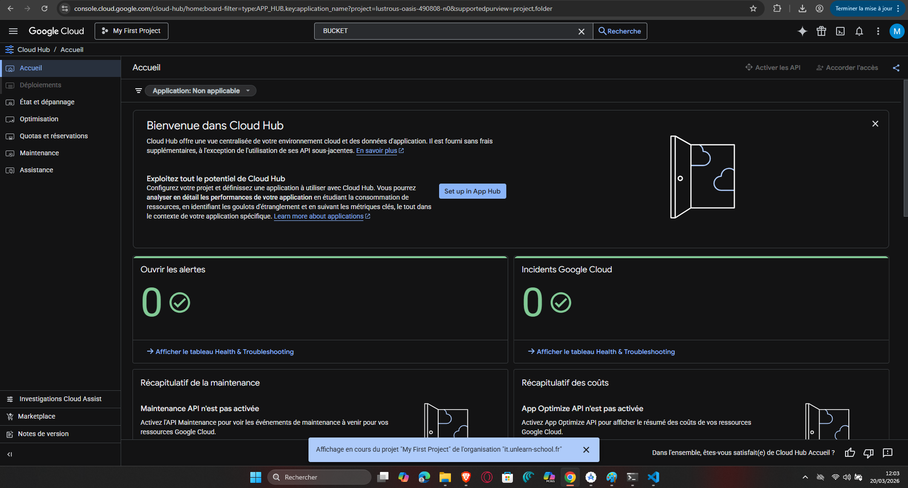
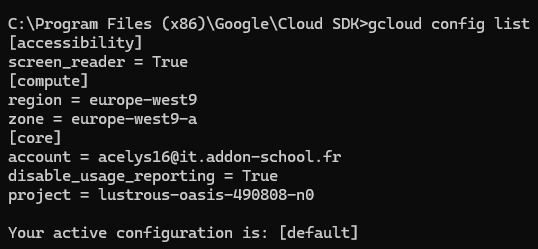
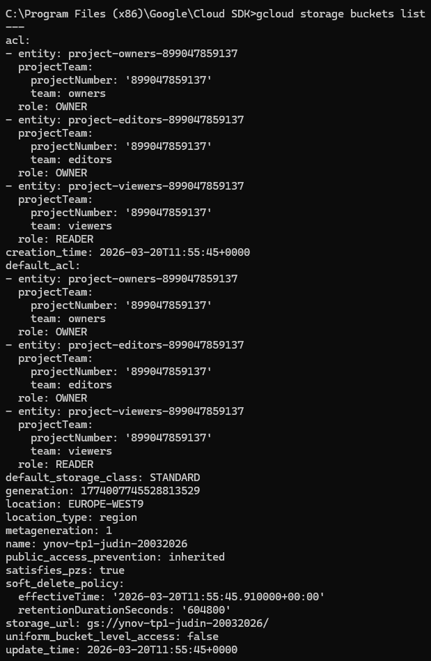
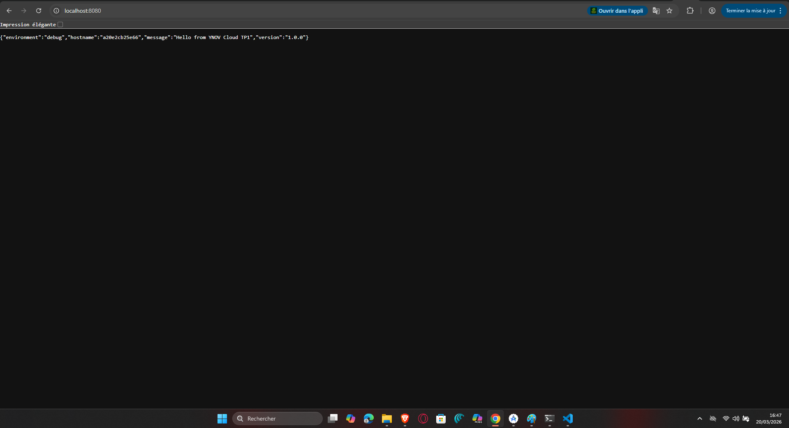

# TP 1 — Fondamentaux Cloud & Setup GCP

**Cours 1 | Développer pour le Cloud | YNOV Campus Montpellier — Master 2**
**Date :** 20/03/2026 | **Durée TP :** 3h | **Plateforme :** Google Cloud Platform

---

## Avant de commencer

Assurez-vous d'avoir activé votre compte GCP en suivant le **GUIDE_ACTIVATION_COMPTE_GCP_ETUDIANT.md** disponible à la racine du module.

### Prérequis

- Compte GCP actif avec crédits disponibles
- `gcloud` CLI installé et initialisé
- Docker installé en local (Docker Desktop)
- Git installé

### Livrables attendus

- [x] Capture d'écran de votre console GCP (projet créé)

- [x] Capture d'écran du terminal : résultat de `gcloud config list`

- [x] Capture d'écran : bucket GCS créé et listé

- [x] Capture d'écran : réponse de votre application Flask en local (`docker run`)

- [x] Réponses aux questions théoriques (dans ce fichier ou sur papier)

---

## Partie 1 — Quiz Fondamentaux Cloud (20 min)

### 1.1 — Modèles de Service

Associez chaque description au bon modèle (IaaS / PaaS / SaaS) :

| Description | Modèle |
|-------------|--------|
| Vous gérez uniquement votre code, l'infrastructure est abstraite | PaaS |
| Vous gérez l'OS, le middleware et l'application sur des ressources virtualisées | IaaS |
| Vous utilisez l'application directement via un navigateur, sans rien gérer | SaaS |
| Exemple GCP : Google Compute Engine | IaaS |
| Exemple GCP : Google App Engine / Cloud Run | PaaS |
| Exemple GCP : Google Workspace (Gmail, Docs) | SaaS |

---

### 1.2 — Les 5 Caractéristiques NIST

Donnez une définition courte (1 phrase) pour chacune des 5 caractéristiques essentielles du cloud selon le NIST :

| # | Caractéristique | Votre définition |
|---|-----------------|------------------|
| NIST #1 | Self-service à la demande | Capacité de commander des ressources automatiquement sans intervention humaine. |
| NIST #2 | Large accès réseau | Services accessibles via les standards du réseau (Internet) depuis n'importe quel appareil. |
| NIST #3 | Mutualisation des ressources | Les ressources physiques sont partagées entre plusieurs clients (multi-tenant). |
| NIST #4 | Élasticité rapide | Capacité d'augmenter ou réduire les ressources quasi instantanément selon le besoin. |
| NIST #5 | Service mesuré | Facturation à l'usage réel (comme l'électricité). |

---

### 1.3 — Architecture Microservices vs Monolithe

Cochez la bonne case pour chaque affirmation :

| Affirmation | Monolithe | Microservices |
|-------------|-----------|---------------|
| Déploiement indépendant de chaque composant | ☐ | ☑ |
| Couplage fort entre les modules | ☑ | ☐ |
| Scalabilité horizontale de chaque service séparément | ☐ | ☑ |
| Debugging centralisé plus simple | ☑ | ☐ |
| Technologie agnostique (polyglot) | ☐ | ☑ |

---

### 1.4 — Services GCP par catégorie

Complétez le tableau en plaçant chaque service GCP dans sa catégorie :

**Services à placer :** Cloud Run, Cloud SQL, Cloud Storage, Compute Engine, BigQuery, VPC, Cloud DNS, Cloud Logging, GKE, Persistent Disk

| Catégorie         | Services GCP                          |
|-------------------|---------------------------------------|
| Calcul (Compute)  | Compute Engine, Cloud Run, GKE        |
| Stockage          | Cloud Storage, Persistent Disk        |
| Base de données   | Cloud SQL, BigQuery                   |
| Réseau            | VPC, Cloud DNS                        |
| Observabilité     | Cloud Logging                         |

---

## Partie 2 — Setup GCP & gcloud CLI (30 min)

### 2.1 — Vérification de l'installation

Exécutez les commandes suivantes et notez les résultats :

```bash
# Vérifier la version de gcloud installée
gcloud --version

# Résultat obtenu :
Google Cloud SDK 561.0.0
bq 2.1.29
core 2026.03.13
gcloud-crc32c 1.0.0
gsutil 5.36

# Vérifier que Docker est installé
docker --version

# Résultat obtenu :
Docker version 29.1.3, build f52814d
```

---

### 2.2 — Initialisation et configuration

Complétez les commandes manquantes (`_______`) puis exécutez-les :

```bash
# Se connecter avec votre compte Google
gcloud auth login

# Vérifier que vous êtes bien authentifié (liste les comptes connectés)
gcloud auth list

# Définir votre projet comme projet par défaut
# (remplacer [MON_PROJET_ID] par votre vrai ID de projet)
gcloud config set project [lustrous-oasis-490808-n0]

# Définir la région par défaut sur Paris
gcloud config set compute/region europe-west9

# Définir la zone par défaut
gcloud config set compute/zone europe-west9-a

# Vérifier la configuration complète
gcloud config list
```

**Question :** Quelle est la différence entre une région et une zone dans GCP ?

**Votre réponse :** La region definit la zone geographique ou est hebergé les données. Quand à la zone, il s'agit d'une sous-division dans la region afin de palier a un probleme sur des zones de la région et garantir une haute disponibilité.

---

### 2.3 — Exploration de la console

Connectez-vous à la console GCP ([console.cloud.google.com](https://console.cloud.google.com)) et répondez :

a) Dans **IAM & Admin → IAM**, quel est votre rôle sur le projet ?

**Réponse :** Propriétaire

b) Dans **Facturation**, quel montant de crédit vous reste-t-il ?

**Réponse :** 254 euros

c) Dans **APIs & Services → Tableau de bord**, listez 3 APIs qui sont déjà activées par défaut :

- API 1 : Analytics Hub API
- API 2 : Cloud SQL
- API 3 : Cloud Storage

d) Activez les APIs nécessaires pour ce module en complétant la commande :

```bash
gcloud services enable \
artifactregistry.googleapis.com \
run.googleapis.com \
container.googleapis.com \
compute.googleapis.com \
storage.googleapis.com

# Vérifier que les APIs sont bien activées
gcloud services list --enabled
```

---

## Partie 3 — Google Cloud Storage : Créer, Utiliser, Supprimer (30 min)

### 3.1 — Créer un bucket Cloud Storage

Un bucket GCS doit avoir un nom globalement unique (dans tout GCP, pas juste dans votre projet).

**Convention de nommage :** `ynov-tp1-[votre-prenom]-[date]`
Exemple : `ynov-tp1-alice-20032026`

```bash
# Remplacer [NOM_BUCKET] par votre nom unique
# --location : choisir une région GCP (utiliser europe-west9)
# --storage-class : utiliser STANDARD
gcloud storage buckets create gs://[NOM_BUCKET] \
--location=europe-west9 \
--storage-class=STANDARD

# Vérifier que le bucket a été créé
gcloud storage buckets list
```

**Question :** Pourquoi les noms de buckets GCS doivent-ils être globalement uniques ?

**Réponse :** Il est possible d'accéder à un bucket via son url et donc le nom unique permet d'avoir des url unique

---

### 3.2 — Uploader et lister des objets

```bash
# Créer un fichier texte local de test
echo "Hello GCP - TP1 YNOV $(date)" > test_tp1.txt

# Uploader le fichier vers votre bucket
gcloud storage cp test_tp1.txt gs://[NOM_BUCKET]/

# Lister les objets dans le bucket
gcloud storage ls gs://[NOM_BUCKET]/

# Télécharger le fichier avec un nouveau nom
gcloud storage cp gs://[NOM_BUCKET]/test_tp1.txt ./test_tp1_downloaded.txt

# Vérifier le contenu
cat test_tp1_downloaded.txt
type test_tp1_downloaded.txt
```

---

### 3.3 — Métadonnées et permissions

```bash
# Obtenir les informations du bucket
gcloud storage buckets describe gs://[NOM_BUCKET]
```

**Répondre :** quel est le storageClass de votre bucket ?

**Réponse :** STANDARD

---

### 3.4 — Nettoyage

```bash
# Supprimer tous les objets du bucket, puis le bucket lui-même
# L'option -r supprime récursivement
gcloud storage rm -r gs://[NOM_BUCKET]/
# Vérifier la suppression
gcloud storage buckets list
```

---

## Partie 4 — Compute Engine : Cycle de Vie d'une VM (25 min)

### 4.1 — Créer une VM minimale

```bash
# Créer une VM de type e2-micro (la plus petite, éligible au Free Tier)
# --image-family : utiliser debian-12
# --image-project : utiliser debian-cloud
gcloud compute instances create tp1-vm \
--machine-type=e2-micro \
--image-family=debian-12 \
--image-project=debian-cloud \
--zone=europe-west9-b \
--tags=http-server

# Lister les instances actives dans votre projet
gcloud compute instances list
```

**Question :** Quelle est la différence entre `--machine-type e2-micro` et `--machine-type n2-standard-4` en termes de coût et d'usage ?

**Réponse :** e2-micro est une machine d'entrée de gamme avec 2 vCPUs partagés, 1 Go RAM alors que n2-standard-4 a 4 vCPUs, 16 Go RAM. L'e2-micro a un cout d'usage plus faible ( ~$0.0076/h  ou environ $5.50/mois si utilisé en continu) et est idéal pour les tests, les environnements de développement ou les petites applications. Concernant le n2-standard-4, il est recommandé pour des applications en production nécessitant plus de puissance (ex : serveurs web, bases de données, traitement de données) et a un cout bien plus élevé (~$0.192/h ou environ $140/mois si utilisé en continu).

---

### 4.2 — Se connecter à la VM via SSH

```bash
# Connexion SSH via gcloud (gère automatiquement les clés SSH)
gcloud compute ssh tp1-vm --zone=europe-west9-b

# Une fois connecté à la VM, vérifier l'OS
uname -a
cat /etc/os-release

# Quitter la VM
exit
```

---

### 4.3 — Supprimer la VM (OBLIGATOIRE)

```bash
# Supprimer la VM pour éviter les frais
# --quiet : ne pas demander de confirmation
gcloud compute instances delete tp1-vm \
--zone=europe-west9-b \
--quiet

# Vérifier que la VM n'existe plus
gcloud compute instances list
```

---

## Partie 5 — Docker : Conteneuriser une Application Flask (30 min)

### 5.1 — L'application Flask

Créez un dossier `tp1-app` et les fichiers suivants :

**tp1-app/app.py** — à compléter :

```python
from flask import Flask, jsonify
import os
import socket

app = Flask(__name__)

@app.route('/')
def home():
    return jsonify({
        "message": "Hello from YNOV Cloud TP1",
        "hostname": socket.gethostname(),
        "environment": os.getenv("APP_ENV", "development"),
        # TODO: Ajouter un champ "version" avec la valeur "1.0.0"
        "version": "1.0.0"
    })

@app.route('/health')
def health():
    # TODO: Retourner un JSON {"status": "ok"} avec le code HTTP 200
    return jsonify({"status": "ok"}), 200

if __name__ == '__main__':
    # TODO: Lire le port depuis la variable d'environnement PORT (défaut: 8080)
    port = int(os.getenv("PORT", 8080))
    app.run(host='0.0.0.0', port=port)
```

**tp1-app/requirements.txt** — à compléter :

```txt
flask==3.0.3  # Utiliser la version 3.0.3
gunicorn==21.2.0
```

---

### 5.2 — Écrire le Dockerfile

**tp1-app/Dockerfile** — à compléter :

```dockerfile
# Utiliser Python 3.12 slim comme image de base
FROM python:3.12-slim

# Définir le répertoire de travail dans le conteneur
WORKDIR /app

# Copier en premier le fichier requirements.txt (optimisation du cache Docker)
# Pourquoi copier requirements.txt séparément avant le reste du code ?
COPY requirements.txt .

# Installer les dépendances Python
RUN pip install --no-cache-dir -r requirements.txt

# Copier le reste du code source
COPY . .

# Exposer le port 8080
EXPOSE 8080

# Variable d'environnement par défaut
ENV APP_ENV=production

# Commande de démarrage avec gunicorn (serveur WSGI production)
# Format : gunicorn --bind 0.0.0.0:[PORT] [MODULE]:[OBJET_APP]
CMD ["gunicorn", "--bind", "0.0.0.0:8080", "app:app"]
```

**Question :** Pourquoi copie-t-on `requirements.txt` avant le code source dans le Dockerfile ?

**Réponse :** On copie requirements.txt avant le code source pour exploiter le cache Docker. Ainsi, si seul le code change, Docker réutilise la couche des dépendances déjà installées (pip install), ce qui accélère les builds. Sans cela, toute modification du code relancerait l'installation des dépendances, même si requirements.txt n'a pas changé.

---

### 5.3 — Créer un .dockerignore

**tp1-app/.dockerignore** — à compléter :

```txt
# Exclure les fichiers inutiles pour réduire la taille de l'image
__pycache__
*.pyc
*.pyo
.env
# Exclure les environnements virtuels Python
.git
.gitignore
```

---

### 5.4 — Build et Run

```bash
cd tp1-app

# Builder l'image Docker
# -t : nommer l'image [nom]:[tag]
docker build -t tp1-flask:v1 .

# Vérifier que l'image a été créée
docker images | grep tp1-flask

# Lancer le conteneur
# -d : mode détaché (background)
# -p [port_local]:[port_conteneur] : mapping de ports
# --name : nommer le conteneur
# -e : variable d'environnement
docker run -d \
-p 8080:8080 \
--name tp1-container \
-e APP_ENV=development \
tp1-flask:v1

# Vérifier que le conteneur tourne
docker ps

# Tester l'application
curl http://localhost:8080/
curl http://localhost:8080/health
```

**Question :** Quelle est la différence entre une image Docker et un conteneur Docker ?

**Réponse :** Une image Docker est un modèle immuable (un "moule") qui contient le code, les dépendances et les instructions pour exécuter une application. Un conteneur Docker est une instance en cours d'exécution de cette image, avec son propre système de fichiers, processus et ressources isolées. En résumé : l'image est le logiciel emballé, le conteneur est le logiciel en train de tourner.

---

### 5.5 — Nettoyage Docker

```bash
# Arrêter le conteneur
docker stop tp1-container

# Supprimer le conteneur (une fois arrêté)
docker rm tp1-container

# Vérifier qu'il n'y a plus de conteneur actif
docker ps
```

---

## Partie 6 — IAM & Service Accounts GCP (25 min)

IAM (Identity and Access Management) est le système de contrôle d'accès de GCP. Il répond à la question : "Qui peut faire quoi sur quelle ressource ?"

### 6.1 — Explorer les rôles IAM

```bash
# Lister les membres IAM de votre projet
gcloud projects get-iam-policy $(gcloud config get-value project)
for /f "delims=" %i in ('gcloud config get-value project') do set PROJECT_ID=%i
gcloud projects get-iam-policy %PROJECT_ID%

# Lister les rôles prédéfinis disponibles pour Cloud Storage
gcloud iam roles list --filter="name:roles/storage" \
--format="table(name,title)"
```

**Question :** Quelle est la différence entre `roles/storage.admin` et `roles/storage.objectViewer` ?

**Réponse :** Comme le dis son nom, objectViewer permet la lecture seul alors que admin octroie le controle total.

---

### 6.2 — Créer un Service Account

Un Service Account est une identité pour les applications (pas pour les humains). Convention : [application]-sa@[project].iam.gserviceaccount.com

```bash
PROJECT_ID=$(gcloud config get-value project)

# Créer un Service Account pour l'application Flask
gcloud iam service-accounts create tp1-app-sa \
--display-name="TP1 Flask App Service Account" \
--description="SA utilisé par l'application Flask pour accéder à GCS"

# Vérifier la création
gcloud iam service-accounts list
```

---

### 6.3 — Attribuer un rôle au Service Account

Principe du moindre privilège : donner uniquement les droits nécessaires, rien de plus.

```bash
PROJECT_ID=$(gcloud config get-value project)
SA_EMAIL="tp1-app-sa@${PROJECT_ID}.iam.gserviceaccount.com"

# Donner uniquement le droit de LIRE les objets GCS (pas d'écriture, pas d'admin)
gcloud projects add-iam-policy-binding ${PROJECT_ID} \
--member="serviceAccount:${SA_EMAIL}" \
--role="roles/storage.objectViewer"

# Vérifier les bindings du projet
gcloud projects get-iam-policy ${PROJECT_ID} \
--flatten="bindings[].members" \
--filter="bindings.members:tp1-app-sa"
```

**Question :** Pourquoi ne faut-il pas donner le rôle `roles/owner` ou `roles/editor` à un Service Account applicatif ?
**Réponse :** Ce sont des roles qui ont trop de permission (suppression de ressources, modification IAM...)

---

### 6.4 — Générer et utiliser une clé de Service Account

```bash
PROJECT_ID=$(gcloud config get-value project)
SA_EMAIL="tp1-app-sa@${PROJECT_ID}.iam.gserviceaccount.com"

# Générer une clé JSON (fichier de credentials)
gcloud iam service-accounts keys create /tmp/tp1-sa-key.json \
--iam-account=${SA_EMAIL}
gcloud iam service-accounts keys create /tmp/tp1-sa-key.json --iam-account=%SA_EMAIL%

# Vérifier que le fichier est créé
ls -lh /tmp/tp1-sa-key.json
dir C:\tmp\tp1-sa-key.json

# Activer le Service Account dans gcloud
gcloud auth activate-service-account \
--key-file=/tmp/tp1-sa-key.json
gcloud auth activate-service-account --key-file=/tmp/tp1-sa-key.json

# Vérifier que gcloud utilise bien le SA
gcloud auth list

# Tester : essayer de créer un bucket avec ce SA
# Cela doit ÉCHOUER car le SA n'a que roles/storage.objectViewer (lecture seule)
gcloud storage buckets create gs://test-sa-${PROJECT_ID} \
--location=europe-west9 2>&1 || echo "Accès refusé (attendu : le SA n'a pas les droits de création de bucket)"

# Remettre l'authentification de votre compte utilisateur
gcloud auth login

# Supprimer la clé (bonne pratique : éviter les clés qui traînent)
rm /tmp/tp1-sa-key.json
del C:\tmp\tp1-sa-key.json

gcloud iam service-accounts keys list \
--iam-account=${SA_EMAIL}
```

**Question :** Quelle alternative aux clés JSON GCP recommande-t-on en production pour éviter de stocker des fichiers de credentials ?

**Réponse :** En production, GCP recommande d'utiliser Workload Identity Federation (mécanisme "keyless") plutôt que des clés JSON. Ce système permet aux applications (par exemple, sur GKE, Cloud Run ou AWS/on-prem) d'emprunter l'identité d'un Service Account sans stocker de fichier de credentials, en s'appuyant sur des fournisseurs d'identité externes (comme GitHub, AWS IAM, etc.) ou des métadonnées GCP.

---

### 6.5 — Supprimer le Service Account (nettoyage)

```bash
gcloud iam service-accounts delete tp1-app-sa@${PROJECT_ID}.iam.gserviceaccount.com --quiet
```

---

## Partie 7 — Docker : Commandes d'Inspection et Debug (20 min)

Cette partie étend le TP Docker avec les commandes essentielles pour débugger un conteneur en production.

### 7.1 — Relancer le conteneur Flask

```bash
cd tp1-app
docker run -d \
-p 8080:8080 \
--name tp1-debug \
-e APP_ENV=debug \
tp1-flask:v1

# Vérifier qu'il tourne
docker ps
```

---

### 7.2 — Inspecter un conteneur

```bash
# Voir la configuration complète du conteneur (JSON détaillé)
docker inspect tp1-debug

# Extraire uniquement l'adresse IP du conteneur
docker inspect tp1-debug \
--format='{{range .NetworkSettings.Networks}}{{.IPAddress}}{{end}}'

# Voir les variables d'environnement injectées
docker inspect tp1-debug \
--format='{{range .Config.Env}}{{println .}}{{end}}'
```

**Question :** quelle valeur a la variable APP_ENV dans le conteneur ?

**Réponse :**: debug

---

### 7.3 — Exécuter des commandes dans un conteneur actif

```bash
# Ouvrir un shell interactif dans le conteneur (comme SSH)
docker exec -it tp1-debug /bin/sh  # Utiliser /bin/sh (pas bash sur slim)

# Une fois dans le conteneur :
# - Vérifier les processus actifs
ps aux

# - Vérifier les fichiers copiés
ls -la /app/

# - Vérifier les variables d'environnement
env | grep APP

# - Tester la connexion réseau depuis le conteneur
wget -qO- http://localhost:8080/health

# Quitter le conteneur (sans l'arrêter)
exit

# Exécuter une commande sans ouvrir un shell interactif
docker exec tp1-debug env | grep APP_ENV
```

---

### 7.4 — Surveiller les ressources consommées

```bash
# Voir les stats CPU/RAM en temps réel (Ctrl+C pour quitter)
docker stats tp1-debug

# Voir les statistiques une seule fois (pas de flux continu)
docker stats --no-stream tp1-debug

# Question : combien de RAM consomme votre application Flask au repos ?
# Réponse : ________

# Voir les logs avec filtre temporel
docker logs --since="5m" tp1-debug  # Logs des 5 dernières minutes
docker logs --tail=20 tp1-debug     # 20 dernières lignes
```

---

### 7.5 — Analyser la taille de l'image par couche

```bash
# Voir l'historique des layers et leur taille
docker history tp1-flask:v1
```

**Question :** quelle couche est la plus volumineuse et pourquoi ?

**Réponse :** La couche de l'os, DEBIAN. Elle contient tous les fichiers essentiels, les bibliothèques système et les binaires nécessaires pour que le conteneur puisse fonctionner comme un environnement Linux complet.

```bash
# Nettoyage
docker stop tp1-debug && docker rm tp1-debug
```

---

## Récapitulatif — Ce que vous avez fait

- Répondu aux questions théoriques sur IaaS/PaaS/SaaS, NIST, Microservices
- Configuré `gcloud` CLI avec votre projet GCP
- Créé, utilisé et supprimé un bucket Cloud Storage
- Créé, connecté et supprimé une VM Compute Engine `e2-micro`
- Conteneurisé une application Flask avec Docker
- Vérifié que l'application répond localement

---

## Compétences validées

- Comprendre et distinguer les modèles de service cloud (IaaS/PaaS/SaaS)
- Utiliser `gcloud` CLI pour interagir avec GCP
- Manipuler Cloud Storage (cycle de vie objet)
- Gérer le cycle de vie d'une VM Compute Engine
- Écrire un Dockerfile et conteneuriser une application
- Créer et utiliser un Service Account avec le principe du moindre privilège
- Débuguer un conteneur Docker (inspect, exec, stats, logs)

---

## Pour le Cours 2 (07/04/2026) — À préparer

- Votre compte GCP doit être actif et configuré
- `gcloud`, `docker`, `git` doivent être installés et fonctionnels
- Capture d'écran d'une commande réussie à remettre au professeur (ex: `gcloud storage ls`)
- Garder le dossier `tp1-app/` — on l'améliorera avec Docker multi-stage et on le déploiera sur Cloud Run

---
